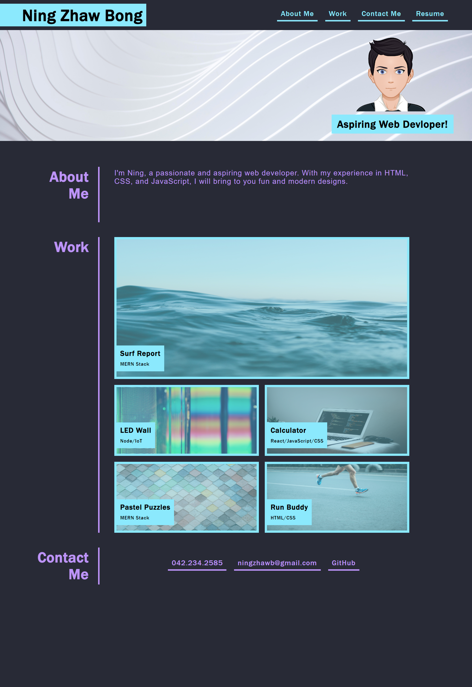
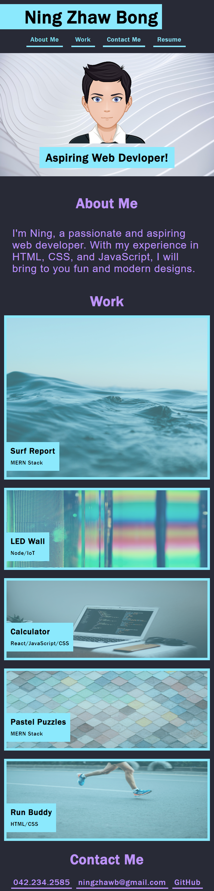
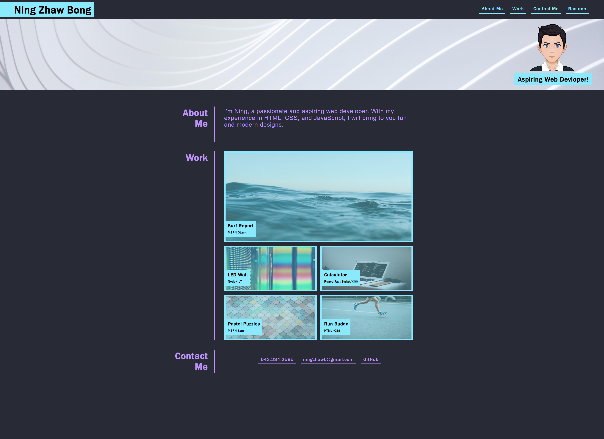

# Ning Zhaw Bong's Portfolio

## Description

This portfolio was created to showcase my work to employers. Some requirements include having navigationg links which upon clicking, the UI scrolls to the corresponding page, the addition of work samples when clicked will bring you to the associated application sample, and the addition of a contact section with links.

  1. The URL of the deployed application: https://ning1604.github.io/Portfolio/
  2. The URL of the GitHub repository: https://github.com/ning1604/Portfolio

## Image of Webpage

The following image shows the web application's appearance:

## Installation

Follow the steps below, or visit: https://docs.github.com/en/repositories/creating-and-managing-repositories/cloning-a-repository

  1. Have this repository open in GitHub and click "Code" and copy the given URL.
  2. Open Git Bash and change to a directory where you want to create the local clone.
  3. Once in the chosen directory location, type in the following command (step 4) and paste in the url of the repository from step 1.
  4. git clone "exampleUrl"
  5. Tip: Ensure that that your URL is inclosed in the quotations.

## Responsive Webpage
Small:

Medium:

Large:

